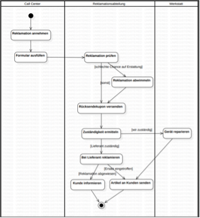
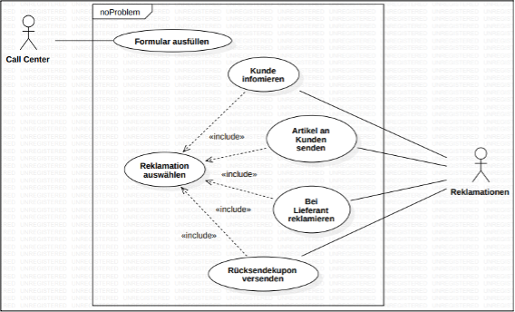

# Analyse

In der Analyse geht es vor allem um das „Was“ im Projekt. Also was ist im Projekt zu realisieren. Schlagwörter sind hier:
-	Funktionale Anforderungen
-	Nicht-Funktionale Anforderungen
-	UseCase Diagramm
-	Prototyping (even. mit dem Kunden)

Achtung! Zu Beginn eines Projektes, in der Planung, werden Ziele definiert. Ziele und Anforderungen sind jedoch etwas Unterschiedliches. 
-	Ein Ziel ist ein zu erreichender Zustand, meist im umfassenden Sinne gemeint. 
-	Eine Anforderung ist eine zu erreichende Eigenschaft, diese muss auf Detailebene definiert werden. In der Analyse geht es um die Anforderungen.

Im Gegensatz zu Zielen müssen Anforderungen
-	Eine Bedingung oder Fähigkeit, die von einer Person zur Lösung eines Problems oder zur Erreichung eines Zieles benötigt wird.
-	Eine Bedingung oder Fähigkeit, die eine Software erfüllen oder besitzen muss, um einen Vertrag, eine Norm oder ein anderes, formell bestimmtes Dokument zu erfüllen.

Bei den Anforderungen sind dann funktionale Anforderungen und nicht funktionale Anforderungen zu differenzieren:
-	Funktionale Anforderungen sind das „Was“ an einem System, also was das System bereitstellen muss
-	Nicht-Funktionale Anforderungen, auch Systemanforderungen, sind dann mehr das „Wie“ in einem System

In der Analyse wird auch damit begonnen UML-Diagramme zu erstellen. Hier ist vor allem das Use Case Diagramm von großer Wichtigkeit. Dieses stellt alle Funktionen eines Systems mit ihren dazugehörigen Aktoren dar. Achtung, ein Use Case Diagramm ist nicht:
-	Ein Bild der Systemarchitektur des zu erstellenden Systems (Wie der Aufbau ist wird hier nicht abgebildet)
-	Zeigt nicht, wer mit der Kommunikation beginnt
-	Zeigt nicht systemrelevante Funktionen, nur jene die für die Nutzer von Interesse sind
-	Zeigt nicht, wie die Anforderungen/ Funktionen miteinander interagieren und in welcher Reihenfolge
Bei bzw. für die Darstellung des Use Case Diagramms gibt es eine Allgemeine und eine Spezifische. Die Spezifische erweitert allerdings die allgemeine Darstellung lediglich um Vererbung und Beziehungen

Nachdem das Use Case Diagramm erstellt ist, müssen die Anforderungen auch spezifiziert werden. Dazu gibt es ein Muster, welches einzuhalten ist:

|                                 |                                                                                                                       |
|---------------------------------|-----------------------------------------------------------------------------------------------------------------------|
| ID                              | Eindeutige Zuordnung der Anforderung im gesamten System (nützlich für große Projekte)                                 |
| Name                            | Eindeutige Name der Anforderung im gesamten System (nützlich für große Projekte)                                      |
| Beschreibung                    | 1-2 Sätze, was mit Funktion getan werden kann                                                                         |
| Layout                          | GUI – Prototyp, Erstellung in Kooperation mit zukünftigen Akteuren                                                    |
| Spezifikation                   | Beinhaltet möglichst genau, was alles mit dieser Funktion getan werden kann, welche Buttons welche Events auslösen, … |
| Nicht-funktionale Anforderungen | Die NFA der Funktion (Rechenleistung und Geschwindigkeit, Sicherheit, …)                                              |
| Definition of Done              | Was ist zu tun, damit diese Funktion fertiggestellt ist                                                               |
| Priorität                       | Wie wichtig ist diese Funktion für das System                                                                         |
| Aufwand (in PT)                 | Wie lange wird es dauern, bis diese Funktion fertiggestellt ist                                                       |

## Diagramme

Das Ergebnis der Analyse ist das Lastenheft, eine grobe Beschreibung des zu erstellenden Systems. Für die Analyse gibt es auch in UML einige Diagramme: 

### Geschäftsprozessmodell

Was ist ein Geschäftsprozess (GP)
- Ist ein Ablauf aus einer strategischen Sicht
- Findet innerhalb eines Unternehmens statt
- Festlegung des gesamten Ablaufs (Definiert)
- Losgelöst von IT, IT unterstützt nur

Vorteile:
-	Definierte Prozesse sichern gleichbleibende Qualität
- Prozesse können nur bei sauberer Definierung von IT unterstützt werden 

Aktivitätendiagramm (ACD) fürs Geschäftsprozessmodell
- Teile
- Swimlanes
- Startpunkt
- Control Flows (Pfeile, die Richtung anweisen)
- Activity
- Guard (Bedingung, dass Weg weiter genommen werden darf)
- Fork (Teil sich in mehrere Prozesse auf (vergleichbar mit Threads), die dann alle parallel ablaufen
- Join (Fügt mehrere Prozesse wieder zusammen (auf alle Threads wird gewartet, bis sie fertig sind)
- Endpunkt

Fehler beim Modellieren
-	Kunde ist keine Unternehmensorganisation
-	Das IT System kann nicht verantwortlich für etwas ein

### UseCase-Diagramm

-	Use Case im Modell
-	Behandeln das System und seine Funktionalitäten (diese sind aus dem Geschäftsprozessmodell)
-	Teil der Analyse (Beschreibung des UseCases, GUI Prototyp, Spezifikation, …)

Teile des Modells:
-	Akteur (Person, IT-System, …): Benennung: nicht User, Administrator; aussagekräftige Namen nutzen
-	System
-	Use Case (Benennung mit Subjekt + Prädikat: Sind meist im Geschäftsprozessmodell vorhanden
-	Strich als Verbindung

