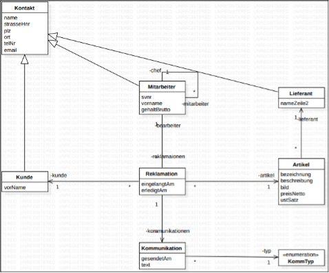
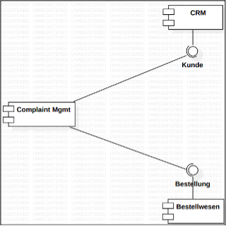
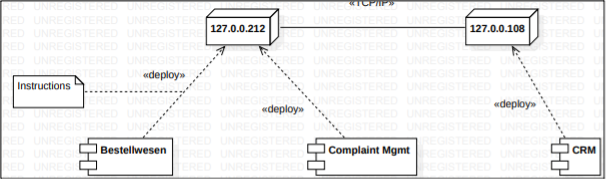
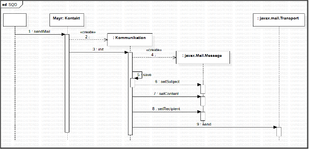
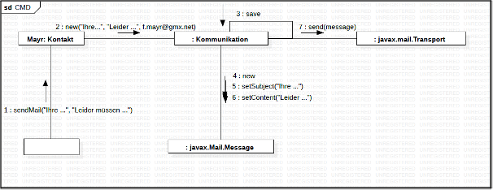
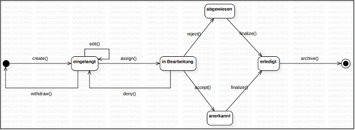

# Design

Design unterteilt sich in
-	Grobentwurf
-	Feinentwurf

-	Im Laufe eines Projektes werden verschiedene Sichten (Diagramme) auf ein System erstellt
-	System muss "prinzipiell" konzipiert werden

Architektur muss festgelegt werden
-	OS
-	Drittanbieter
-	Webanwendung / App/ Application
-	DBMS (Welche Art, was für ein Hersteller)
-	Server (Fat Client, Thin Client, …)
-	Komponenten

Agile Methoden/Entwicklung
-	Grobentwurf, wann er zu machen ist, ist in Scrum nicht geregelt
-	Bei Scrum wird mit einer User Story begonnen, kommt man im Laufe des Projekts darauf, dass die Architektur nicht passt, so wird das System auf neue Architekturen adaptiert

Im Design wird nun das System designt. Im Design geht es nun um das „Wie“. Es wird der Aufbau des Systems beschrieben/designt. Dies wird vor allem durch UML-Diagramm realisiert.

## Diagramme

### Klassendiagramm

### Komponentendiagramm

-	Darstellung: Lollipop Notation
-	Eine Komponente kapselt ein bestimmtes Verhalten unter einer API

### Verteilungsdiagramm

-	Wo werden die Runtimekomponenten auf welche Netzwerkknoten installiert
-	Netzwerkknoten repräsentierten Hardware oder virtualisierte Hardware (Darstellung ist der Quader)
-	Runtimekomponente:	Komponenten die direkt am System installiert werden müssen, Bsp. ein .jar File, ein .exe File

Installationsanweisungen
-	Geben Aussage, was in welcher Reihenfolge getan werden muss, welche Voraussetzungen, welche Ablauf, …
-	Muss Versionsangaben beinhalten

### Objekt-Modell

-	Es wird ein Szenario dargestellt
-	Es werden für Objekte konkrete Werte definiert (Values of an object)
-	Kommunikation zwischen Objekte ist eine Message (Softwareentwicklung 2.Klasse)

2 Arten der Darstellung
-	Sequenz-Diagramm (SQD)
-	Communication Diagramm (CMD), früher Collaboration Diagramm

#### Sequenzdiagramm

#### Kommunikationsdiagramm

### Objektzustandsmodell

-	Welche Zustände können ein Objekt annehmen
-	Mit welcher Reihenfolge kann ein Objekt seine Zustände ändern

