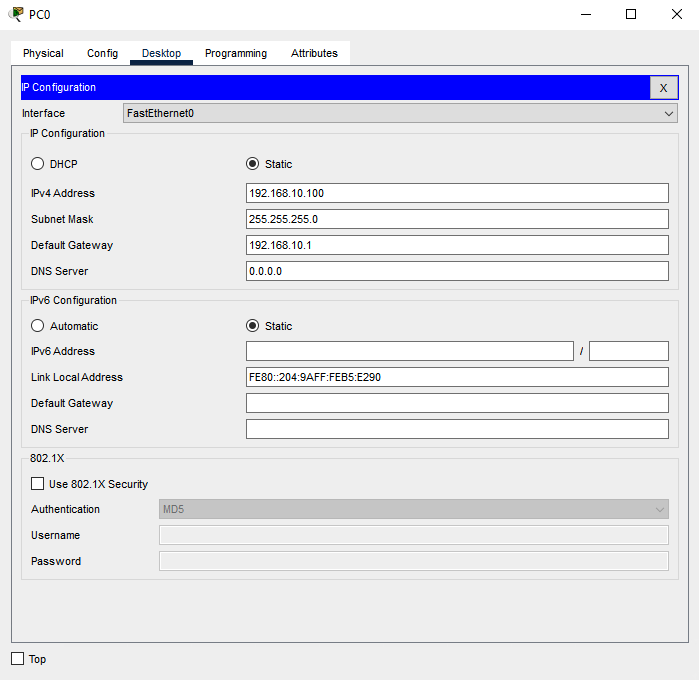
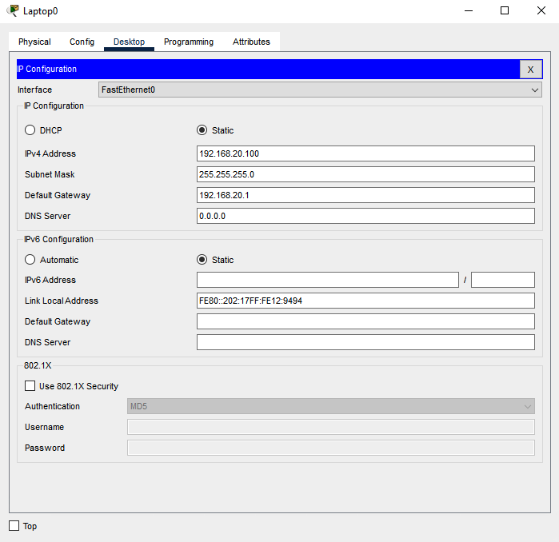
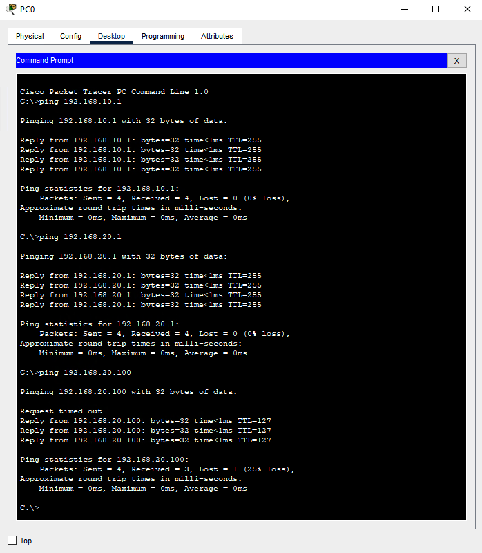

# Router on a stick

## Router

```
Router>enable
Router#conf t

Router(config)#int g0/0
Router(config-if)#no shutdown
Router(config-if)#exit


Router(config)#int g0/0.10
Router(config-subif)#encapsulation dot1q 10
Router(config-subif)#ip address 192.168.10.1 255.255.255.0
Router(config-subif)#exit


Router(config)#int g0/0.20
Router(config-subif)#encapsulation dot1q 20
Router(config-subif)#ip address 192.168.20.1 255.255.255.0
Router(config-subif)#exit
```

## Switch

```
Switch>enable
Switch#conf t

Switch(config)#vlan 10
Switch(config-vlan)#name vlan10
Switch(config-vlan)#exit

Switch(config)#vlan 20
Switch(config-vlan)#name vlan20
Switch(config-vlan)#exit

Switch(config)#int g0/1
Switch(config-if)#switchport mode trunk
Switch(config-if)#exit


Switch(config)#int range fa 0/1 - 12
Switch(config-if-range)#switchport mode access
Switch(config-if-range)#switchport access vlan 10
Switch(config-if-range)#exit

Switch(config)#int range fa 0/13 - 24
Switch(config-if-range)#switchport mode access
Switch(config-if-range)#switchport access vlan 20
Switch(config-if-range)#exit
```

## Computer

| PC0                                                      | Laptop0                                                   |
|----------------------------------------------------------|-----------------------------------------------------------|
| VLAN 10:<br>IP Adresse: 192.168.10.100<br>Gateway: 192.168.10.1 | VLAN 20:<br>IP Adresse: 192.168.20.100<br>Gateway: 192.168.20.1 |
|                                              |                                           |

## Pings


